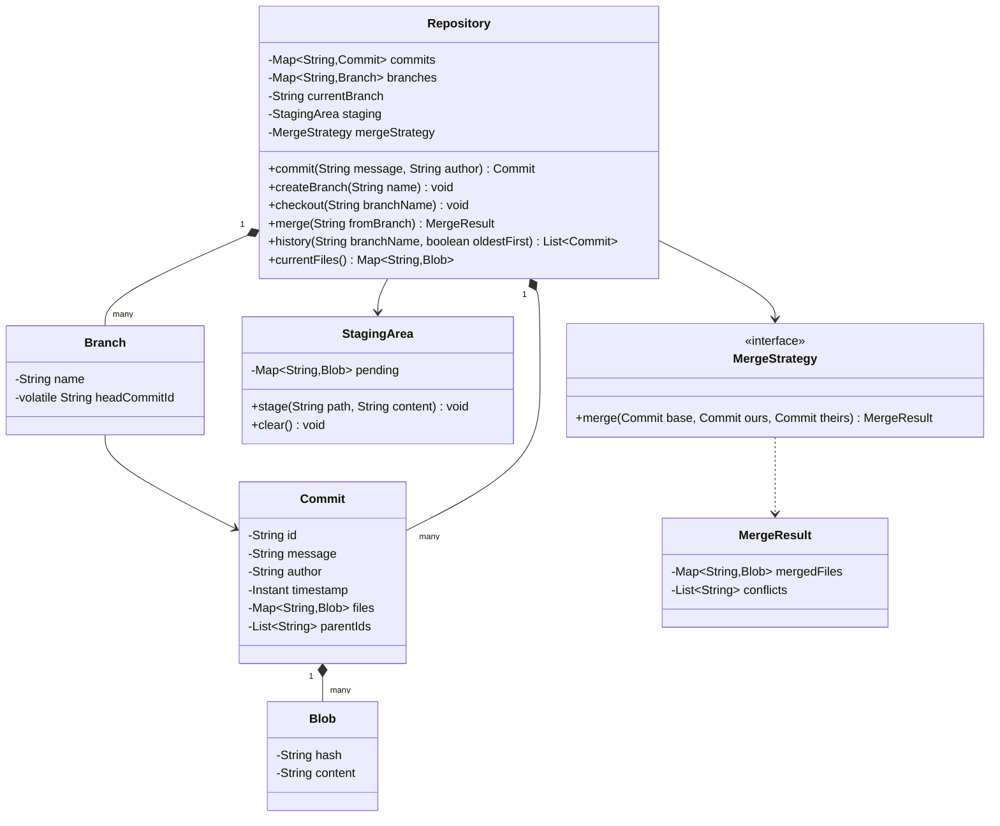
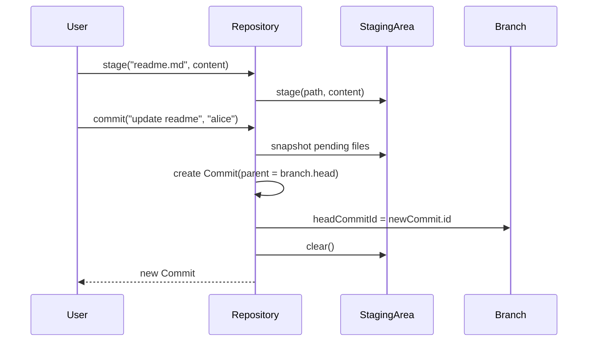

# Design a version control system

**A version control system tracks snapshots (commits) of a set of files over time, organized into branches that can diverge and merge.**

## Requirements

### Functional requirements

1. Stage file changes and commit them as a snapshot with a message and author.
2. Create a branch that starts from the current commit and can move independently.
3. Switch between branches, updating the working set of files.
4. View the commit history of a branch, oldest or newest first.
5. Merge one branch into another when there's no conflict (same file changed differently on both sides).

### Non-functional requirements

- Commits are immutable once created; history never rewrites in place.
- Two branches must be able to advance independently without affecting each other's history.
- Adding a new merge strategy shouldn't change how commits or branches are stored.

### Out of scope

- Remote repositories, push, and pull.
- Full three-way diff/merge algorithms (we detect conflicts, not auto-resolve content).

## Clarifying questions to ask

| Question | Assumption we make |
|---|---|
| Is a commit a full snapshot or a diff? | A full snapshot of file contents, kept simple over storage efficiency. |
| Can a branch be deleted? | Yes, as long as it's not the currently checked-out branch. |
| What counts as a merge conflict? | The same file path has different content added on both branches since the common ancestor. |
| Is history linear or can commits have multiple parents? | A commit has one parent normally, two after a merge. |

## Core entities

| Entity | Responsibility |
|---|---|
| `Blob` | Immutable content of one file at one point in time |
| `Commit` | Immutable snapshot: file map, message, author, parent(s) |
| `Branch` | A movable pointer to the latest commit on that line |
| `StagingArea` | Holds pending changes before the next commit |
| `MergeStrategy` | Detects conflicts and produces a merged file map |
| `Repository` | Entry point: stage, commit, branch, checkout, merge |

## Class diagram



*`Commit` objects form an immutable graph via `parentIds`; `Branch` is just a pointer that moves as new commits land.*

## Key flows



*Committing snapshots the staging area, links it to the branch's current head as parent, then moves the branch pointer forward.*

## Design patterns used

| Pattern | Where | Why |
|---|---|---|
| Strategy | `MergeStrategy` | Swap conflict-detection rules without touching `Repository` |
| Memento (variant) | `Commit` as an immutable snapshot | Lets any branch or commit be restored by pointer alone |
| Facade | `Repository` | Users call `commit`, `checkout`, `merge`; they never touch the commit graph directly |

## Implementation

`Blob` and `Commit` are immutable; a `Commit` records its parents rather than storing diffs:

```java
public record Blob(String hash, String content) {
    public static Blob of(String content) {
        return new Blob(Integer.toHexString(content.hashCode()), content);
    }
}

public class Commit {
    private final String id;
    private final String message;
    private final String author;
    private final Instant timestamp;
    private final Map<String, Blob> files;
    private final List<String> parentIds;

    public Commit(String message, String author, Map<String, Blob> files, List<String> parentIds) {
        this.id = UUID.randomUUID().toString();
        this.message = message;
        this.author = author;
        this.timestamp = Instant.now();
        this.files = Map.copyOf(files);
        this.parentIds = List.copyOf(parentIds);
    }

    public String id() { return id; }
    public Map<String, Blob> files() { return files; }
    public List<String> parentIds() { return parentIds; }
    public String message() { return message; }
    public Instant timestamp() { return timestamp; }
}
```

`Branch` is a thread-safe pointer, and `StagingArea` batches pending changes:

```java
public class Branch {
    private final String name;
    private volatile String headCommitId;

    public Branch(String name, String headCommitId) {
        this.name = name;
        this.headCommitId = headCommitId;
    }

    public String name() { return name; }
    public String headCommitId() { return headCommitId; }
    public void moveHead(String commitId) { this.headCommitId = commitId; }
}

public class StagingArea {
    private final Map<String, Blob> pending = new ConcurrentHashMap<>();

    public void stage(String path, String content) {
        pending.put(path, Blob.of(content));
    }

    public Map<String, Blob> snapshot() { return Map.copyOf(pending); }
    public void clear() { pending.clear(); }
}
```

A simple merge strategy compares both branch tips against their common ancestor and flags files changed on both sides:

```java
public record MergeResult(Map<String, Blob> mergedFiles, List<String> conflicts) {}

public interface MergeStrategy {
    MergeResult merge(Commit base, Commit ours, Commit theirs);
}

public class ThreeWayMergeStrategy implements MergeStrategy {
    public MergeResult merge(Commit base, Commit ours, Commit theirs) {
        Map<String, Blob> result = new HashMap<>(ours.files());
        List<String> conflicts = new ArrayList<>();

        Set<String> allPaths = new HashSet<>(theirs.files().keySet());
        allPaths.addAll(base.files().keySet());

        for (String path : allPaths) {
            Blob baseBlob = base.files().get(path);
            Blob ourBlob = ours.files().get(path);
            Blob theirBlob = theirs.files().get(path);

            boolean changedByUs = !Objects.equals(baseBlob, ourBlob);
            boolean changedByThem = !Objects.equals(baseBlob, theirBlob);

            if (changedByThem && !changedByUs) {
                result.put(path, theirBlob);
            } else if (changedByThem && changedByUs && !Objects.equals(ourBlob, theirBlob)) {
                conflicts.add(path);
            }
        }
        return new MergeResult(result, conflicts);
    }
}
```

`Repository` ties the graph, branches, and staging together:

```java
public class Repository {
    private final Map<String, Commit> commits = new ConcurrentHashMap<>();
    private final Map<String, Branch> branches = new ConcurrentHashMap<>();
    private volatile String currentBranch;
    private final StagingArea staging = new StagingArea();
    private final MergeStrategy mergeStrategy;

    public Repository(MergeStrategy mergeStrategy) {
        this.mergeStrategy = mergeStrategy;
        Commit initial = new Commit("initial commit", "system", Map.of(), List.of());
        commits.put(initial.id(), initial);
        branches.put("main", new Branch("main", initial.id()));
        currentBranch = "main";
    }

    public void stage(String path, String content) { staging.stage(path, content); }

    public synchronized Commit commit(String message, String author) {
        Branch branch = branches.get(currentBranch);
        Commit parent = commits.get(branch.headCommitId());
        Map<String, Blob> files = new HashMap<>(parent.files());
        files.putAll(staging.snapshot());

        Commit newCommit = new Commit(message, author, files, List.of(parent.id()));
        commits.put(newCommit.id(), newCommit);
        branch.moveHead(newCommit.id());
        staging.clear();
        return newCommit;
    }

    public void createBranch(String name) {
        Branch current = branches.get(currentBranch);
        branches.put(name, new Branch(name, current.headCommitId()));
    }

    public void checkout(String branchName) {
        if (!branches.containsKey(branchName)) throw new IllegalArgumentException("Unknown branch");
        currentBranch = branchName;
    }

    public synchronized MergeResult merge(String fromBranch) {
        Commit ours = commits.get(branches.get(currentBranch).headCommitId());
        Commit theirs = commits.get(branches.get(fromBranch).headCommitId());
        String ancestorId = findCommonAncestor(ours, theirs);
        if (ancestorId == null) throw new IllegalStateException("No common ancestor with " + fromBranch);
        Commit base = commits.get(ancestorId);

        MergeResult result = mergeStrategy.merge(base, ours, theirs);
        if (result.conflicts().isEmpty()) {
            Commit merged = new Commit("merge " + fromBranch, "system",
                result.mergedFiles(), List.of(ours.id(), theirs.id()));
            commits.put(merged.id(), merged);
            branches.get(currentBranch).moveHead(merged.id());
        }
        return result;
    }

    public List<Commit> history(String branchName, boolean oldestFirst) {
        List<Commit> result = new ArrayList<>();
        String cursor = branches.get(branchName).headCommitId();
        while (cursor != null) {
            Commit c = commits.get(cursor);
            result.add(c);
            cursor = c.parentIds().isEmpty() ? null : c.parentIds().get(0);
        }
        if (oldestFirst) Collections.reverse(result);
        return result;
    }

    public Map<String, Blob> currentFiles() {
        Commit head = commits.get(branches.get(currentBranch).headCommitId());
        return head.files();
    }

    private String findCommonAncestor(Commit a, Commit b) {
        Set<String> aAncestors = new HashSet<>();
        String cursor = a.id();
        while (cursor != null) {
            aAncestors.add(cursor);
            cursor = commits.get(cursor).parentIds().isEmpty() ? null : commits.get(cursor).parentIds().get(0);
        }
        cursor = b.id();
        while (cursor != null && !aAncestors.contains(cursor)) {
            cursor = commits.get(cursor).parentIds().isEmpty() ? null : commits.get(cursor).parentIds().get(0);
        }
        return cursor;
    }
}
```

## Handling concurrency

- **Two commits on the same branch at once.** `commit` is `synchronized` on the repository, so reading the branch head, building the new commit, and moving the pointer happen as one unit; a second committer sees the updated head.
- **A commit and a merge racing on the same branch head.** `merge` is also `synchronized` on the repository, so it can't read a branch head that a concurrent `commit` is mid-way through updating, and vice versa.
- **Reading history while a commit is in progress.** `commits` is a `ConcurrentHashMap` and commits are immutable, so a concurrent reader either sees the old head or the new one, never a half-built commit.
- **Checkout racing a commit on the same branch.** `currentBranch` is `volatile`; a checkout mid-commit only affects which branch the *next* commit targets, since the in-flight commit already captured its branch reference locally.
- **Coarse locking on `commit`.** A single lock serializes all commits across all branches, which is simple but limits throughput; scope the lock to the specific `Branch` object instead if branches need to commit in parallel.

## Extending the design

**How do you support a real diff-based merge instead of whole-file conflict detection?**
Replace `ThreeWayMergeStrategy` with one that runs a line-level diff on conflicting files and only flags a conflict when the same lines changed. `MergeResult` already separates conflicts from merged content.

**How do you add tags (named pointers to a specific commit that never move)?**
Add a `Map<String, String> tags` in `Repository` mapping tag name to commit ID. Unlike `Branch`, a tag has no `moveHead` method.

**How do you support a detached HEAD (checking out a specific commit, not a branch)?**
Add a `currentCommitId` alongside `currentBranch`; when set, `commit` creates a new unnamed line of history instead of moving a branch pointer, until the user creates a branch from it.

## Key takeaways

- Make commits immutable snapshots linked by parent IDs; branches are just movable pointers into that graph.
- Keep merge conflict detection behind a strategy interface so the algorithm can improve independently of storage.
- Synchronize the read-modify-write span of a commit, not the whole repository, to reduce contention over time.
- Finding a common ancestor is a graph walk over immutable data, so it's safe to run without locking.
