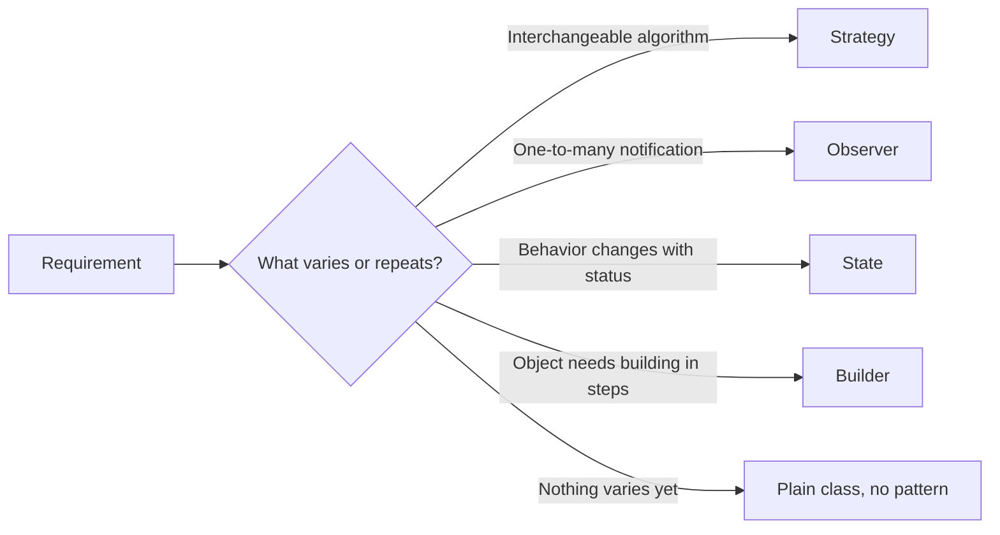

# How to choose design patterns

**Pick a design pattern only after you've named a concrete piece of variation or complexity in the requirements — never bolt one on to look advanced.**

## The problem

Interview candidates often reach for a pattern before they need one. Designing an elevator system, a candidate might jump straight to:

```java
public interface ElevatorFactory {
    Elevator createElevator();
}

public class StandardElevatorFactory implements ElevatorFactory {
    public Elevator createElevator() { return new Elevator(); }
}
```

There's only one kind of elevator in the requirements, and nothing suggests more are coming. The factory adds a file and an interface without solving a real problem. An interviewer who asks "why a factory here?" and hears "it felt more object-oriented" sees that as a red flag, not a strength.

## The idea

Every pattern exists to solve one recurring shape of problem: Strategy swaps an algorithm, Observer notifies dependents of a change, State changes behavior as an object's status changes. Choosing a pattern means matching the requirement's shape to the pattern's shape — not sprinkling patterns for style points.

The safest approach: write the plain version first. When a specific requirement creates duplication, branching, or a "this will probably change" spot, reach for the pattern that fits that specific shape.



*Match the pattern to what specifically varies in the requirement.*

## How it works

1. Write the requirement in plain language: "the same request can be handled in more than one way" or "many parts must react when one thing changes."
2. Match that sentence to a pattern's core intent — don't match on structure or class names.
3. Check whether the codebase already handles this case with a plain `if` or `switch`. If yes and it's simple, keep it plain.
4. Introduce the pattern only where the variation lives, not across the whole design.
5. Be ready to justify the choice in one sentence: "State here because the elevator's behavior depends on whether it's idle, moving, or under maintenance."

## Worked example

For an elevator system, two requirements actually call for patterns:

> "The elevator's behavior differs depending on whether it's idle, moving, or under maintenance." → behavior tied to status: **State**.

> "Multiple elevators must be notified when a floor button is pressed, so the nearest one responds." → one event, many potential reactors: **Observer**.

A third requirement — "elevators always move by the same rule: answer the nearest request first" — has no variation yet, so it stays a plain method, no pattern. The flowchart also lists Strategy and Builder; neither requirement here calls for them. Strategy would only enter as an extension, for example a second dispatch rule that swaps the nearest-elevator heuristic for a load-balancing one.

```java
public interface ElevatorState {
    void handleRequest(Elevator elevator, int floor);
}

public class IdleState implements ElevatorState {
    public void handleRequest(Elevator elevator, int floor) {
        elevator.setState(new MovingState());
        elevator.moveTo(floor);
        elevator.setState(new IdleState());
    }
}

public class MovingState implements ElevatorState {
    public void handleRequest(Elevator elevator, int floor) {
        System.out.println("Still in transit; try floor " + floor + " again shortly");
    }
}

public class MaintenanceState implements ElevatorState {
    public void handleRequest(Elevator elevator, int floor) {
        System.out.println("Elevator unavailable: under maintenance");
    }
}

public class Elevator {
    private ElevatorState state = new IdleState();
    private int currentFloor = 0;

    public void setState(ElevatorState state) { this.state = state; }
    public void requestFloor(int floor) { state.handleRequest(this, floor); }
    public void moveTo(int floor) {
        System.out.println("Moving to floor " + floor);
        currentFloor = floor;
    }
    public int currentFloor() { return currentFloor; }
}
```

A floor button notifies every listener through Observer. One listener, the `Dispatcher`, picks the nearest elevator with a plain method; a second listener can update a floor display without touching the dispatcher:

```java
public interface FloorRequestListener {
    void onFloorRequested(int floor);
}

public class FloorButton {
    private final List<FloorRequestListener> listeners = new ArrayList<>();

    public void subscribe(FloorRequestListener listener) { listeners.add(listener); }

    public void press(int floor) {
        listeners.forEach(l -> l.onFloorRequested(floor));
    }
}

public class Dispatcher implements FloorRequestListener {
    private final List<Elevator> elevators;
    public Dispatcher(List<Elevator> elevators) { this.elevators = elevators; }

    public void onFloorRequested(int floor) {
        nearestTo(floor).requestFloor(floor);
    }

    private Elevator nearestTo(int floor) {
        return elevators.stream()
            .min(Comparator.comparingInt(e -> Math.abs(e.currentFloor() - floor)))
            .orElseThrow();
    }
}
```

Wiring a second, unrelated listener costs one line and needs no change to `Dispatcher`:

```java
FloorButton button = new FloorButton();
button.subscribe(new Dispatcher(elevators));
button.subscribe(floor -> System.out.println("Display: floor " + floor + " requested"));
```

- `ElevatorState` matches the requirement's exact shape: behavior tied to status.
- `FloorRequestListener` matches "one event, many reactors" exactly — no extra indirection.
- The nearest-elevator rule stays a plain method inside `Dispatcher`, because nothing in the requirements says it will vary.

## Checklist

- State the requirement in plain language before naming a pattern.
- Confirm the codebase doesn't already solve it with a simple `if` or enum.
- Match the pattern's core intent to the requirement's shape, not to its class structure.
- Apply the pattern only to the part that varies, not to the whole design.
- Be able to justify the pattern in one sentence; if you can't, don't use it.
- Prefer zero patterns over a wrong-fit pattern — a plain class is never a red flag.

## Related topics

- [Composing objects principle](../principles/composing-objects-principle.md)
- [How to write clean code](write-clean-code.md)
- [Design a parking lot](../questions/design-parking-lot.md)

## Key takeaways

- Choose a pattern because a specific requirement matches its intent, not for style.
- Write the plain version first; let duplication or branching justify the pattern.
- Apply the pattern locally, to the part that actually varies.
- Being able to say why in one sentence is the real test of a good choice.
