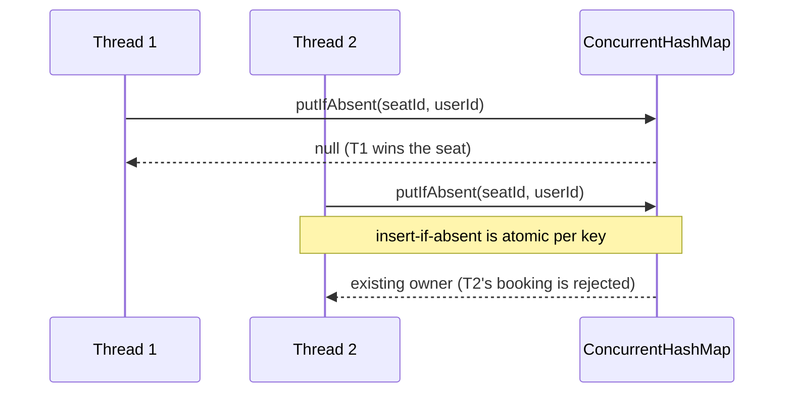

# How to handle concurrency scenarios

**When an interviewer asks "what if two threads call this at once," name the exact race, then pick the narrowest lock or atomic operation that closes it.**

## The problem

You're designing a movie booking system. Two users click "book" on the same seat at nearly the same time:

```java
public class Showtime {
    private final Set<String> bookedSeats = new HashSet<>();

    public boolean bookSeat(String seatId) {
        if (!bookedSeats.contains(seatId)) {
            bookedSeats.add(seatId);
            return true;
        }
        return false;
    }
}
```

`contains` and `add` are two separate steps. Between them, another thread can run the same check, see the seat as free, and also add it. Both threads get `true`, and the seat is double-booked. This is a check-then-act race, and it's the most common concurrency bug in interviews.

## The idea

Concurrency bugs in LLD interviews almost always reduce to one of three shapes: check-then-act races (read a value, then act on it, with another thread interleaving), shared mutable state with no synchronization, or multiple locks taken in different orders across threads (deadlock).

You don't need a global lock for most of these. Lock or synchronize at the smallest unit that actually has shared state — one seat, one account, one counter — so unrelated operations don't block each other.



*`putIfAbsent` checks and inserts atomically per key, so only one thread ever wins a seat.*

## How it works

1. Name the race out loud: "two threads can both pass the availability check before either commits."
2. Identify the smallest piece of state involved (one seat, not the whole showtime).
3. Reach for an atomic, built-in operation first: `ConcurrentHashMap.compute`, `putIfAbsent`, or `AtomicReference.compareAndSet`.
4. Only add an explicit lock (`synchronized`, `ReentrantLock`) when the atomic operation can't express the check-and-set you need.
5. If you must hold more than one lock at a time, always acquire them in the same global order, to avoid deadlock.

## Worked example

Fix the double-booking race with `ConcurrentHashMap.putIfAbsent`, which performs the check and the insert as one atomic step:

```java
public class Showtime {
    private final ConcurrentHashMap<String, String> seatOwner = new ConcurrentHashMap<>();

    public boolean bookSeat(String seatId, String userId) {
        return seatOwner.putIfAbsent(seatId, userId) == null;
    }
}
```

`putIfAbsent` returns `null` only if this call was the one that inserted the value, so exactly one caller sees `true` per seat, no matter how many threads race.

When the state is a single reference rather than a map entry, `AtomicReference.compareAndSet` gives you the same atomic check-and-set:

```java
public class Seat {
    private final AtomicReference<String> heldBy = new AtomicReference<>();

    public boolean tryHold(String userId) {
        return heldBy.compareAndSet(null, userId);
    }

    public void release() { heldBy.set(null); }
}
```

`compareAndSet` only succeeds if the field is still `null` when the thread runs, so two threads can never both hold the same seat. This scales to many seats without a shared lock, since each `Seat` has its own `AtomicReference`.

For an operation that spans two accounts — say, transferring a booking credit between users — lock both, in a fixed order, to avoid deadlock:

```java
public class Account {
    private final String id;
    private BigDecimal balance;

    public Account(String id, BigDecimal balance) {
        this.id = id;
        this.balance = balance;
    }

    public String id() { return id; }
    public synchronized void debit(BigDecimal amount) { balance = balance.subtract(amount); }
    public synchronized void credit(BigDecimal amount) { balance = balance.add(amount); }
}

public class CreditService {
    public void transferCredit(Account from, Account to, BigDecimal amount) {
        Account first = from.id().compareTo(to.id()) < 0 ? from : to;
        Account second = first == from ? to : from;
        synchronized (first) {
            synchronized (second) {
                from.debit(amount);
                to.credit(amount);
            }
        }
    }
}
```

Sorting by a stable ID before locking means every thread acquires locks in the same order, so two transfers in opposite directions can't deadlock on each other.

## Checklist

- State the exact race in one sentence before picking a fix.
- Reach for `ConcurrentHashMap.putIfAbsent`/`compute` or `AtomicReference.compareAndSet` before writing an explicit lock.
- Lock at the smallest unit with shared state (per seat, per account), not the whole system.
- Never assume an instance method marked `synchronized` protects state shared across other instances — it only locks that one object.
- When locking two resources, sort by a stable key first so every thread locks in the same order.
- Say what happens to the losing thread: does it retry, fail, or fall back?

## Related topics

- [Coupling and cohesion](../principles/coupling-and-cohesion.md)
- [Design a parking lot](../questions/design-parking-lot.md)
- [How to choose design patterns](choose-design-patterns.md)

## Key takeaways

- Most interview concurrency bugs are check-then-act races on shared state.
- Prefer atomic collection operations and `compareAndSet` over hand-written locks.
- Lock at the narrowest scope that has real shared state, not globally.
- Fixed lock ordering across threads prevents deadlock when more than one lock is needed.
