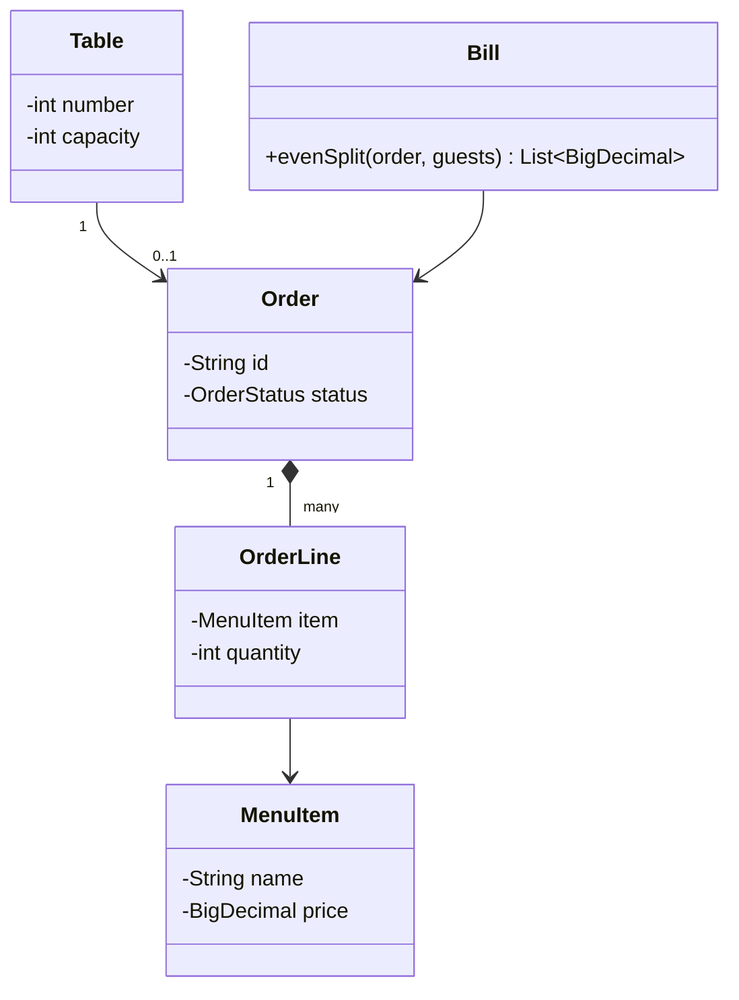

# How to identify entities and model relationships

**Before you write a line of code in an LLD interview, pull the nouns and verbs out of the problem statement and turn them into entities and the relationships between them.**

## The problem

You're asked to design a restaurant management system. Under time pressure, it's tempting to start coding right away:

```java
public class Restaurant {
    List<Object> tables;
    List<Object> orders;
    List<Object> menuItems;
    // now what goes in "Object"?
}
```

Without first naming the entities and how they connect, you end up guessing at fields, then reworking the class list mid-interview when you realize a `Table` needs to reference an `Order`, or that a `MenuItem` belongs to a `Category`. That rework costs more time than planning up front.

## The idea

An entity is a distinct "thing" in the problem domain that has its own identity and data: a `Table`, an `Order`, a `MenuItem`. A relationship describes how two entities connect: one `Order` belongs to one `Table`, one `Order` has many `OrderLine` entries.

Reading the requirements as nouns (entities) and verbs (behavior and relationships) gives you a checklist before you open your editor. It also surfaces the relationships that decide your class diagram: association, aggregation, and composition.



*A table holds at most one active order; an order owns its line items outright.*

## How it works

1. Underline every noun in the requirements. Each recurring, meaningful noun is a candidate entity.
2. Cross out nouns that are just attributes of another entity (a "price" is a field on `MenuItem`, not its own class).
3. For each pair of entities that interact, ask: does one own the other's lifecycle (composition), does one just reference the other (aggregation or association), or is it a one-off interaction (dependency)?
4. Write the cardinality on each relationship: one-to-one, one-to-many, many-to-many.
5. Sketch a class diagram from this list before writing any method bodies.

## Worked example

For the restaurant system, list requirements, then extract entities:

> "Guests are seated at tables. A waiter opens an order for a table, adds menu items with quantities, and sends it to the kitchen. The bill splits by item or evenly across guests."

Nouns: guest, table, waiter, order, menu item, quantity, kitchen, bill. Trim `quantity` (a field on a new `OrderLine` entity, needed to pair a menu item with a count), `kitchen` (out of scope unless kitchen routing is required), `guest` (a count, not an object with identity), and `waiter` (an actor who calls the system, not data the system stores). That leaves:

| Entity | Responsibility |
|---|---|
| `Table` | Tracks seating capacity and the current order, if any |
| `Order` | Tracks status and the list of order lines |
| `OrderLine` | Tracks one menu item and its quantity |
| `MenuItem` | Tracks name and price |
| `Bill` | Computes totals from an order, by item or by guest count |

Relationships: `Table` has at most one active `Order` (association, since a table outlives any single order). `Order` owns its `OrderLine` entries — deleting the order deletes its lines (composition). `OrderLine` references a shared `MenuItem` (association; many orders reference the same menu item).

```java
public class Table {
    private final int number;
    private final int capacity;
    private Order activeOrder;

    public Table(int number, int capacity) {
        this.number = number;
        this.capacity = capacity;
    }

    public void openOrder(Order order) {
        if (activeOrder != null) {
            throw new IllegalStateException("Table " + number + " already has an open order");
        }
        this.activeOrder = order;
    }

    public Optional<Order> activeOrder() { return Optional.ofNullable(activeOrder); }
}

public enum OrderStatus { OPEN, SENT, PAID }

public class Order {
    private final String id;
    private final List<OrderLine> lines = new ArrayList<>();
    private OrderStatus status = OrderStatus.OPEN;

    public Order(String id) { this.id = id; }

    public void addLine(MenuItem item, int quantity) {
        lines.add(new OrderLine(item, quantity));
    }

    public BigDecimal subtotal() {
        return lines.stream()
            .map(l -> l.item().price().multiply(BigDecimal.valueOf(l.quantity())))
            .reduce(BigDecimal.ZERO, BigDecimal::add);
    }

    public OrderStatus status() { return status; }
    public void markSent() { status = OrderStatus.SENT; }
}

public record OrderLine(MenuItem item, int quantity) {}
public record MenuItem(String name, BigDecimal price) {}

public class Bill {
    public List<BigDecimal> evenSplit(Order order, int guests) {
        BigDecimal share = order.subtotal()
            .divide(BigDecimal.valueOf(guests), 2, RoundingMode.HALF_UP);
        return Collections.nCopies(guests, share);
    }
}
```

The code follows directly from the entity table — no guessing at fields mid-implementation.

## Checklist

- Underline nouns; drop the ones that are just attributes.
- For each entity pair, decide: composition (owns lifecycle), aggregation (shares, doesn't own), or association (loose reference).
- Write cardinality (1-1, 1-many, many-many) next to each relationship.
- Draw the class diagram before writing method bodies.
- Say your assumptions out loud — "I'm assuming one table has at most one active order" — so the interviewer can correct you early.
- Re-check entities against the functional requirements: does every requirement map to a method on some entity or service?

## Related topics

- [Separation of concerns](../principles/separation-of-concerns.md)
- [How to write clean code](write-clean-code.md)
- [Design a parking lot](../questions/design-parking-lot.md)

## Key takeaways

- Extract entities from the nouns in the requirements, and drop nouns that are really just fields.
- Classify each relationship as composition, aggregation, or association before coding.
- Write cardinalities down; they decide whether a field is a single reference or a collection.
- A five-minute entity list saves a mid-interview redesign.
