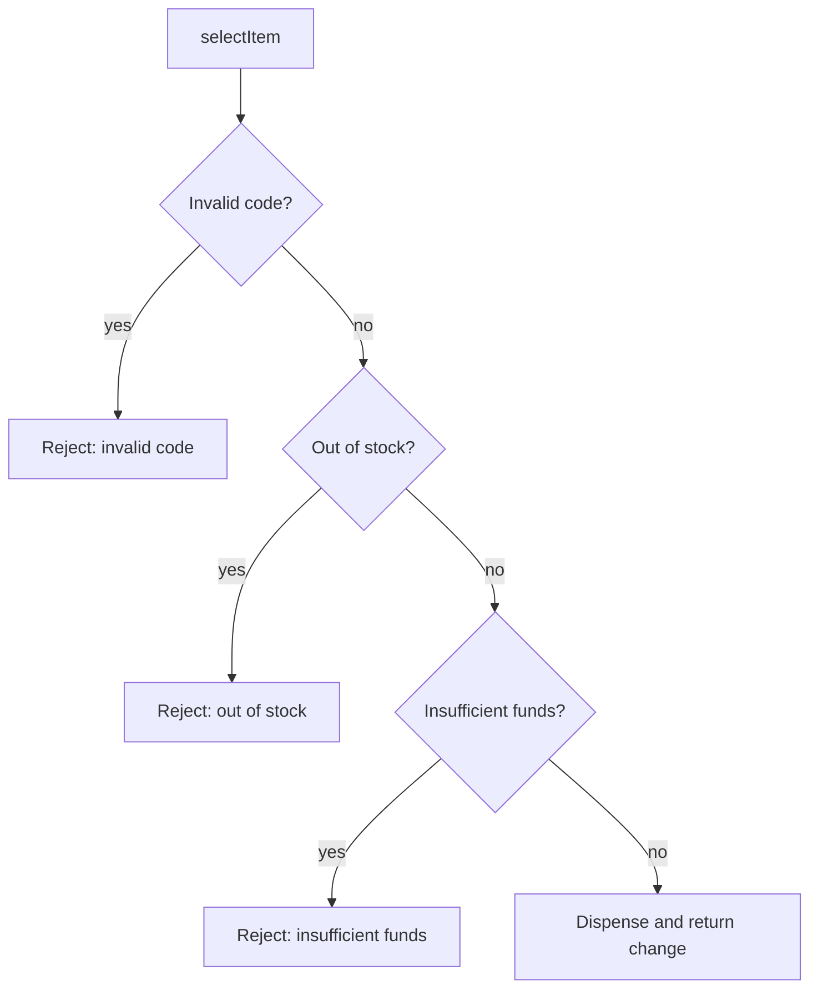

# How to write clean code

**Clean code in a machine-coding interview means short, well-named methods, guard clauses instead of nested conditionals, and no dead or copy-pasted logic — written fast, without sacrificing readability.**

## The problem

Under interview time pressure, code tends to collapse into one long method. Here's a vending machine's `selectItem` written under pressure:

```java
public class VendingMachine {
    public void selectItem(String code, BigDecimal inserted, Map<String, BigDecimal> prices,
                           Map<String, Integer> stock) {
        if (code != null) {
            if (prices.containsKey(code)) {
                if (stock.get(code) > 0) {
                    if (inserted.compareTo(prices.get(code)) >= 0) {
                        stock.put(code, stock.get(code) - 1);
                        BigDecimal change = inserted.subtract(prices.get(code));
                        System.out.println("Dispensing " + code);
                        if (change.compareTo(BigDecimal.ZERO) > 0) {
                            System.out.println("Change: " + change);
                        }
                    } else {
                        System.out.println("Insufficient funds");
                    }
                } else {
                    System.out.println("Out of stock");
                }
            } else {
                System.out.println("Invalid code");
            }
        }
    }
}
```

Four levels of nesting hide the real logic. A reviewer has to hold the whole pyramid in their head to find the happy path. This is the code an interviewer sees first, and it reads as rushed even if it's correct.

## The idea

Clean code favors flat structure and honest names over clever compression. Two habits do most of the work: guard clauses that exit early on bad input, and small methods named after what they check or do. Once the pyramid is flattened, each condition reads as one sentence.

Clean code isn't about adding layers of abstraction — in an interview, over-engineering costs as many points as messy code. It's about making the same logic easy to scan in one pass.

This isn't only about looks. A reviewer who has to trace four levels of nesting to find the happy path is more likely to miss a bug hiding in it. Flat code lets a reader check each condition once against the requirements, then move on to the next one.



*Guard clauses turn nested conditions into a flat sequence of early exits.*

## How it works

1. List every failure case as a question: invalid code, out of stock, insufficient funds.
2. Write one guard clause per question, each returning or throwing immediately.
3. Leave only the success path at the bottom, unindented.
4. Extract any calculation with a name of its own (`changeDue`, `isAvailable`) into a small method.
5. Name methods and variables after domain concepts, not implementation details (`dispense`, not `updateMapAndPrint`).

## Worked example

Rewrite the vending machine with guard clauses and small, named methods:

```java
public class VendingMachine {
    private final Map<String, BigDecimal> prices;
    private final Map<String, Integer> stock;

    public VendingMachine(Map<String, BigDecimal> prices, Map<String, Integer> stock) {
        this.prices = prices;
        this.stock = stock;
    }

    public BigDecimal selectItem(String code, BigDecimal inserted) {
        if (!prices.containsKey(code)) {
            throw new IllegalArgumentException("Invalid code: " + code);
        }
        if (!isAvailable(code)) {
            throw new IllegalStateException("Out of stock: " + code);
        }
        BigDecimal price = prices.get(code);
        if (inserted.compareTo(price) < 0) {
            throw new IllegalStateException("Insufficient funds for " + code);
        }
        dispense(code);
        return changeDue(inserted, price);
    }

    private boolean isAvailable(String code) {
        return stock.getOrDefault(code, 0) > 0;
    }

    private void dispense(String code) {
        stock.put(code, stock.get(code) - 1);
    }

    private BigDecimal changeDue(BigDecimal inserted, BigDecimal price) {
        return inserted.subtract(price);
    }
}
```

- Each guard clause states one failure in one line; there's no nesting to track.
- `isAvailable`, `dispense`, and `changeDue` read as domain actions, not map manipulation or arithmetic.
- `selectItem` returns the change instead of printing, so the caller decides how to show it — easier to test, too.
- A unit test now needs one line per case: `assertThrows(..., () -> machine.selectItem("A1", BigDecimal.ZERO))`.
- `changeDue` is one line today, but giving it a name means a future rounding rule has a single place to live.

## Checklist

- Replace nested `if` chains with guard clauses that exit early.
- Give each method one job and a name that states it.
- Keep methods under about 20 lines; extract a helper if you're scrolling.
- Avoid duplicated logic — if you copy-paste a block, extract it instead.
- Return values instead of printing, so the logic is testable.
- Use meaningful names even under time pressure: `isAvailable`, not `check2`.
- Don't add abstractions (interfaces, factories) the problem doesn't call for; that's also unclean for this format.

## Related topics

- [Separation of concerns](../principles/separation-of-concerns.md)
- [Coupling and cohesion](../principles/coupling-and-cohesion.md)
- [How to identify entities and model relationships](identify-entities-and-relationships.md)

## Key takeaways

- Guard clauses remove nesting and make the happy path obvious.
- Extract named methods for any calculation or check that isn't a one-liner.
- Prefer domain names over implementation-describing names.
- Clean means readable and flat, not maximally abstracted — don't over-engineer under time pressure.
